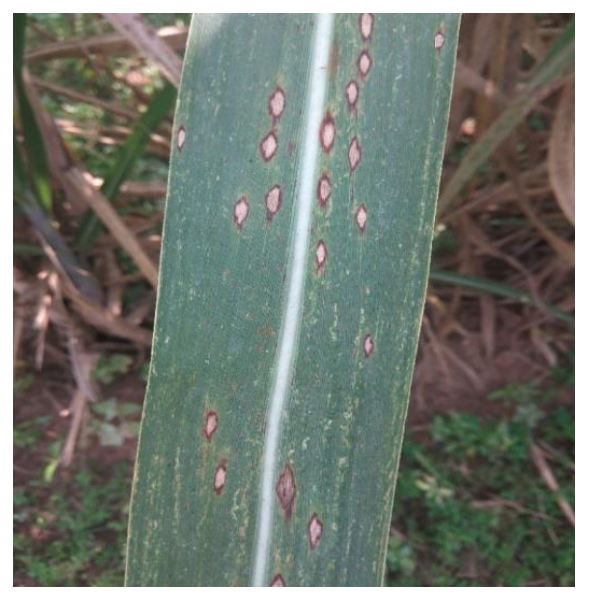
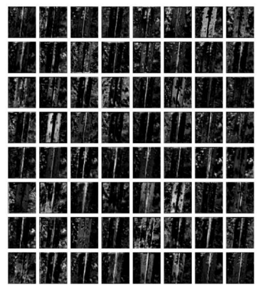

# pytorch-sugarcane
A deep learning approach to Identify crop disease, (an image classification task).

# Introduction

Crop disease recognition remains a significant challenge for the agricultural industry. However, advancements in visual computing, coupled with enhanced computational hardware, have paved the way for automated disease identification. Convolutional Neural Network (CNN) architectures, when applied to publicly available datasets, have showcased their effectiveness. To assess the performance of current state-of-the-art classification models in real-world, uncontrolled conditions encountered on-site, we curated a dataset featuring five sugarcane plant diseases. These images were sourced from fields across various regions of Karnataka, India, captured by camera devices with varying resolutions and lighting conditions. The models, trained on this diverse sugarcane dataset, achieved an impressive accuracy of 93.20% on the test set and 76.40% on images collected from different reputable online sources. This underscores the robustness of our approach in recognizing intricate patterns and variations present in practical scenarios. In summary, employing CNNs on a highly diverse dataset emerges as a promising strategy for the development of automated crop disease recognition systems.

# Dataset

The dataset contains 2940 images of sugarcane leaves belonging to 6 different classes
(consisting of 5 diseases and 1 healthy). These include major diseases that affect the crop in India.
All the images were taken in a natural environment with numerous variations. The images were
taken at various cultivation fields including the University of Agricultural Sciences, Mandya
Bangalore and nearby farms belonging to farmers. All the images were taken using phone cameras
at various angles, orientations, backgrounds accounting for most of the variations that can appear
for images taken in the real world. The dataset was collected with the company of experienced
pathologists.

_Fig 1. Example of leaf images from our dataset, representing every class. 1) Helminthosporium
Leaf Spot 2) Red Rot 3) Cercospora Leaf Spot 4) Rust 5) Yellow Leaf Disease 6) Healthy._

# Classification

We trained a Resnet50 model in two ways, by training the entire model in one case,
and only the fully connected part in another case. Transfer learning was used in both cases starting
from pre-trained weights on the ImageNet dataset. Here also, we note that weights obtained from
training the fully connected part only were used as the starting point for the training of the entire
network. Optimizer used - Stochastic Gradient Descent with Restarts was used in all the cases

# Results
Achieved an acuuracy of 93.0 % on test test. All networks were trained on 80:20 Split.
Networks ran for a total of 15 epochs when training only the fully connected layers and 25 epochs when training all the layers

 
 _Fig 2. Example image of a leaf from our test dataset suffering from Helminthosporium Leaf Spot_

 

_Fig 3.Visualization of activations in the initial layer of Resnet-50 architecture depicting that the model has efficiently learnt to activate against diseased spots on the example leaf._

# How to Run

To test the mode you can run the infer file by loading the saved model and testing on the sample data.

`run infer.py`
